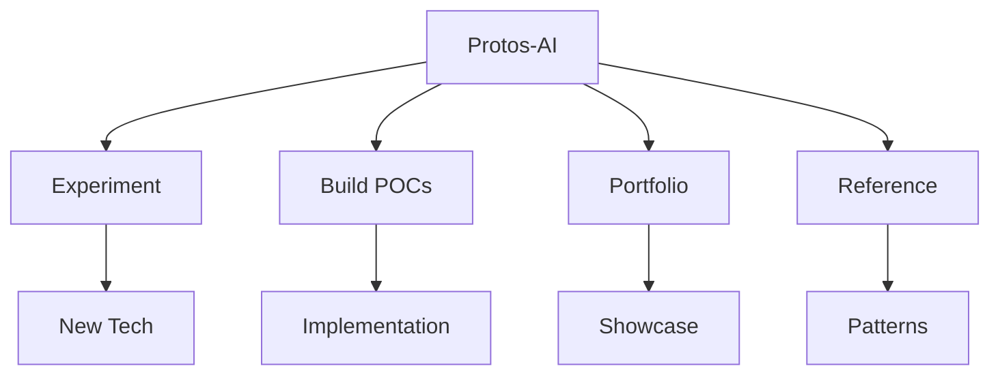
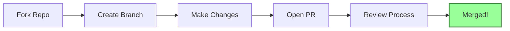
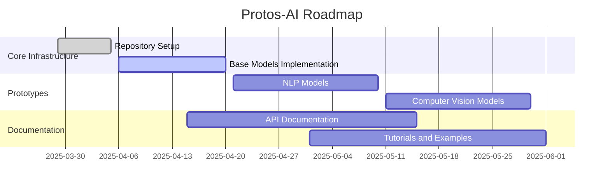

<div align="center">

```
┏━━━━━━━━━━━━━━━━━━━━━━━━━━━━━━━━━━━━━━━━━━━━━━━━━━━━━━━━━━━━━━━━━━━━━━━━━━━━━┓
┃                                                                              ┃
┃   ██████╗ ██████╗  ██████╗ ████████╗ ██████╗ ███████╗       █████╗ ██╗      ┃
┃   ██╔══██╗██╔══██╗██╔═══██╗╚══██╔══╝██╔═══██╗██╔════╝      ██╔══██╗██║      ┃
┃   ██████╔╝██████╔╝██║   ██║   ██║   ██║   ██║███████╗█████╗███████║██║      ┃
┃   ██╔═══╝ ██╔══██╗██║   ██║   ██║   ██║   ██║╚════██║╚════╝██╔══██║██║      ┃
┃   ██║     ██║  ██║╚██████╔╝   ██║   ╚██████╔╝███████║      ██║  ██║██║      ┃
┃   ╚═╝     ╚═╝  ╚═╝ ╚═════╝    ╚═╝    ╚═════╝ ╚══════╝      ╚═╝  ╚═╝╚═╝      ┃
┃                                                                              ┃
┃                     Experimenting with AI, one prototype at a time           ┃
┃                                                                              ┃
┗━━━━━━━━━━━━━━━━━━━━━━━━━━━━━━━━━━━━━━━━━━━━━━━━━━━━━━━━━━━━━━━━━━━━━━━━━━━━━┛
```

# 🧠 Protos-AI

A comprehensive repository for experimenting with AI prototypes, small projects, and proofs of concept. This repository serves as a portfolio and library of AI-focused projects, showcasing implementations and research in various AI domains.

[](https://www.python.org/downloads/)
[](https://python-poetry.org/)
[](https://opensource.org/licenses/MIT)
[](https://github.com/GenAi-Protos/Protos-Ai/graphs/commit-activity)
[](https://makeapullrequest.com)

<br>

<p align="center">
  
  
  
  
  
</p>

</div>

## 🚀 Purpose

<table>
<tr>
<td width="70%">

Protos-AI is designed to:
- 🔬 Experiment with new AI technologies and approaches
- 🛠️ Create and maintain proof-of-concept (POC) implementations
- 📊 Build a portfolio of small AI projects
- 📚 Serve as a reference library for common AI patterns and solutions

</td>
<td>



</td>
</tr>
</table>

## 📂 Repository Structure

<details open>
<summary><b>Organization</b></summary>
<br>

Each prototype or project is organized in its own directory:

```
Protos-Ai/
├── .gitignore          # Git ignore file with Python-specific patterns
├── .env.example        # Example environment variables file
├── pyproject.toml      # Poetry configuration for dependency management
├── README.md           # This documentation
└── [project-name]/     # Individual project directories will be created as needed
```

New projects will be created in separate directories based on their specific requirements.

</details>

## 🛠️ Setup and Installation

### Prerequisites

- Python 3.11 or higher
- [Poetry](https://python-poetry.org/docs/#installation) for dependency management

<div align="center">

### ⚡ Quick Start

</div>

<table>
<tr>
<td>

1️⃣ **Clone the repository**

Using HTTPS:
```bash
git clone https://github.com/GenAi-Protos/Protos-Ai.git
cd Protos-Ai
```

Or using SSH (requires SSH key setup):
```bash
git clone git@github.com:GenAi-Protos/Protos-Ai.git
cd Protos-Ai
```

</td>
<td>

2️⃣ **Install & Activate**

```bash
# Install dependencies
poetry install

# Activate virtual environment
poetry shell
```

</td>
</tr>
</table>

## 📋 Usage

Each project or prototype has its own specific usage instructions. Refer to the README file within each project directory for detailed information.

<details open>
<summary><b>🚀 Adding a New Project</b></summary>
<br>

### Step 1: Create a project directory

```bash
mkdir Protos-Ai/new-project-name
```

### Step 2: Initialize your project structure

```bash
# Create basic files
touch Protos-Ai/new-project-name/README.md
touch Protos-Ai/new-project-name/__init__.py
```

### Step 3: Document your project

Create a comprehensive README.md with:
- 📝 Project overview and purpose
- 🔧 Installation and setup instructions
- 📊 Usage examples with code snippets
- 📚 Any relevant citations or references

### Step 4: Manage dependencies

```bash
# Add a single package
poetry add package-name

# Add a development dependency
poetry add --group dev package-name

# Add multiple packages
poetry add package1 package2 package3
```

### Example project setup

```python
# Quick example of using a Protos-AI component
from protos_ai.models import SimpleTransformer

model = SimpleTransformer(hidden_size=768, num_heads=12)
output = model.forward(input_data)
print(f"Model output shape: {output.shape}")
```

</details>

## 📐 Project Structure Best Practices

<div align="center">

### 📊 Recommended Structure

</div>

```
new-project-name/
├── __init__.py             # Makes the directory a package
├── README.md               # Project documentation
├── requirements.txt        # Project-specific requirements
├── data/                   # Data files (consider adding to .gitignore if large)
│   ├── raw/                # Original, immutable data
│   └── processed/          # Processed data
├── notebooks/              # Jupyter notebooks
├── src/                    # Source code
│   └── __init__.py
└── models/                 # Saved model files
```

### 🔐 Environment Setup

<table>
<tr>
<td width="50%">

For project-specific environment variables:

1️⃣ Copy the root `.env.example` to your project directory
2️⃣ Modify it for your project's needs
3️⃣ Add it to `.gitignore` to avoid committing secrets

</td>
<td>

Example `.env` file:
```bash
# API Keys
OPENAI_API_KEY=sk-xxxx

# Model Settings
MODEL_PATH=./models/
DEFAULT_MODEL=gpt-4
```

</td>
</tr>
</table>

## 🤝 Contributing

<div align="center">

### We welcome all contributors! 

</div>



<details>
<summary><b>Contribution Steps</b></summary>
<br>

1. Fork the repository
2. Create your feature branch: `git checkout -b feature/amazing-feature`
3. Commit your changes: `git commit -m 'Add some amazing feature'`
4. Push to the branch: `git push origin feature/amazing-feature`
5. Open a Pull Request

For major changes, please open an issue first to discuss what you would like to change.

</details>

## 📊 Project Roadmap



## 🔧 Project Management

<table>
<tr>
<td>

- 🐛 **Issues**: Use GitHub Issues for bug reports, feature requests, and general tasks
- 📋 **Projects**: Organize work using GitHub Projects for kanban-style boards
- 💬 **Discussions**: For general questions and community discussions

</td>
<td>


</td>
</tr>
</table>
